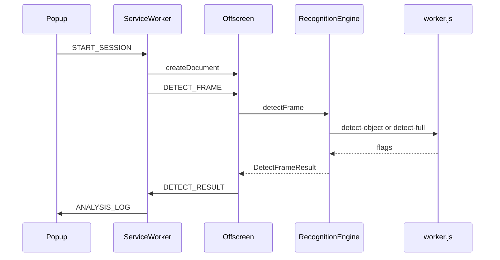

# Canvas AI 扩展架构

## 概述

本扩展从目标网页抓取 `<canvas>`，每秒导出 JPEG，在 Offscreen Document 中通过 **Recognition Worker**（`public/worker.js`）运行 YOLO + face-api 推理。**TensorFlow 仅在 Worker 内加载，后端仅 WebGPU**。结果输出到 Popup 日志与控制台。

各文件职责、消息流转与实现细节见 **[recognition-implementation.md](./recognition-implementation.md)**。

## 环境要求

- **Node = 12.7.0**（`package.json` 的 `engines.node` 锁定）
- yarn
- Chrome / Edge 113+ 且支持 WebGPU

## 模块划分

| 模块 | 路径 | 职责 |
|------|------|------|
| Content Script | `src/content/canvasCapture.ts` | 每秒抓取 canvas JPEG |
| Service Worker | `src/background/serviceWorker.ts` | Offscreen 生命周期、消息路由、检测队列 |
| Offscreen | `src/offscreen/offscreen.ts` | 帧队列、`RecognitionEngine` 调度 |
| 识别引擎 | `src/recognition/` | Worker RPC、围栏、启动节奏（boot 15s / full） |
| Worker | `public/worker.js` | YOLO + face-api 推理（唯一推理面） |
| Popup | `src/popup/popup.ts` | 预览、日志、开始/停止 |

## 识别调度

| 时段 | 行为 |
|------|------|
| 启动后 0–15s | 每 tick `detect-object`（仅 YOLO 四项） |
| 15s 之后 | 每 tick `detect-full`（YOLO + face 八项同帧） |

Worker 初始化或推理失败时 **直接报错**（无主线程降级）。

## 消息协议

| 消息类型 | 方向 | 说明 |
|----------|------|------|
| `START_SESSION` | Popup → SW | 启动分析 |
| `STOP_SESSION` | Popup → SW | 停止分析 |
| `DETECT_FRAME` | SW → Offscreen | 送入 JPEG 检测 |
| `DETECT_RESULT` | Offscreen → SW | 8 项布尔结果 |
| `SET_MASTER_FACE` | Popup → SW → Offscreen | 换人基准人脸 |

完整列表见 `src/shared/messages.ts`。

## 检测队列

Service Worker 与 Offscreen 均只保留最新一帧，避免 Worker 忙时堆积。

## 数据流



## 静态资源

- `yarn copy-assets`：从 aiIdentification 复制 `models/`、`js/face-api.js`、`js/tf-csp-prelude.js`
- `public/worker.js`：**扩展自有**，不从 aiIdentification 覆盖
- `js/tf-webgpu-bundle.js`：webpack 打包产物，供 Worker `importScripts`

## 日志格式

```
[canvas-ai][full] not_person=无人；has_phone=疑似手机
```
