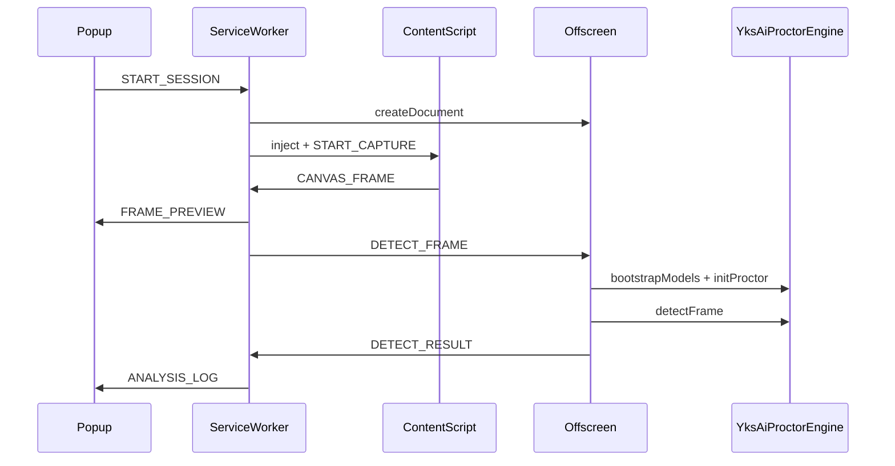

# Canvas AI 扩展架构

## 概述

本扩展从目标网页抓取可见且面积最大的 `<canvas>`，每秒导出 JPEG 预览，并在 Offscreen Document 中运行 TensorFlow.js AI 推理（YOLO + face-api）。**TensorFlow 后端仅允许 WebGPU，禁止 WebGL 回退**，结果输出到 Popup 日志与控制台。

## 环境要求

- **Node = 12.7.0**（`package.json` 的 `engines.node` 锁定）
- yarn
- Chrome / Edge 113+ 且支持 WebGPU

## 模块划分

| 模块 | 文件 | 职责 |
|------|------|------|
| Content Script | `src/content/canvasCapture.ts` | 每秒 `toDataURL('image/jpeg')` 抓取第一个 canvas |
| Service Worker | `src/background/serviceWorker.ts` | Offscreen 生命周期、消息路由、检测队列 |
| Offscreen | `src/offscreen/offscreen.ts` | 加载 AI 引擎并执行 `detectFrame` |
| Popup | `src/popup/popup.ts` | JPEG 预览、日志展示、开始/停止控制 |
| AI 引擎 | `src/ai/` | 自 aiIdentification 同步的最小推理核心 |

## 消息协议

| 消息类型 | 方向 | 说明 |
|----------|------|------|
| `START_SESSION` | Popup → SW | 启动当前 tab 分析 |
| `STOP_SESSION` | Popup → SW | 停止分析 |
| `START_CAPTURE` | SW → Content | 开始 1s 定时抓取 |
| `STOP_CAPTURE` | SW → Content | 停止抓取 |
| `CANVAS_FRAME` | Content → SW | JPEG 帧数据 |
| `CAPTURE_ERROR` | Content → SW | 抓取错误 |
| `FRAME_PREVIEW` | SW → Popup | 预览帧 |
| `DETECT_FRAME` | SW → Offscreen | 送入 AI 检测 |
| `DETECT_RESULT` | Offscreen → SW | 检测结果 |
| `ANALYSIS_LOG` | SW → Popup | 格式化日志 |
| `SET_MASTER_FACE` | Popup → SW → Offscreen | 设置换人基准人脸（覆盖内置 `image/123213123.png`） |
| `SESSION_ERROR` | SW → Popup | 会话错误 |
| `SESSION_STATE` | SW → Popup | 运行状态 |

## 错误码

| 代码 | 含义 |
|------|------|
| `NO_CANVAS` | 页面上未找到 canvas |
| `TAINTED` | canvas 跨域污染，无法导出 |
| `ZERO_SIZE` | canvas 宽高为 0 |

## 检测队列

Service Worker 维护 `isDetecting` 标志。若上一帧推理未完成，新帧写入 `pendingFrame`（仅保留最新），避免 `PROCTOR_WORKER_BUSY` 堆积。

## Offscreen 初始化流程



## AI 源码同步

`scripts/sync-ai-engine.js` 从 `d:\dev\aiIdentification\src` 复制 yolo 引擎与 proctor 辅助文件到 `src/ai/`，并 patch：

- 模型 URL → `chrome.runtime.getURL('models/')`
- Worker URL → `chrome.runtime.getURL('worker.js')`
- face-api URL → `chrome.runtime.getURL('models/face-api/')`
- TensorFlow 后端：主线程与 Worker **仅 webgpu**（`EXT_TF_BACKEND` / `initWebGpuBackend`）；禁止 webgl
- `EXT_PERFORMANCE`：`staggerYoloAndFace: true`，YOLO 每帧、face-api 降频
- 运行时通过 `src/ai/tfGlobal.ts` 的 `getTfGlobal()` 解析 `globalThis.tf`（避免 webpack `import * as tf` 拿不到 `setBackend`）

aiIdentification 升级后需手动执行 `yarn sync-ai` 重新同步。

## 日志格式

```
[canvas-ai][object] {"not_person":false,"has_phone":true,...}
```

告警项在 Popup 中以红色高亮，并显示中文标签。
