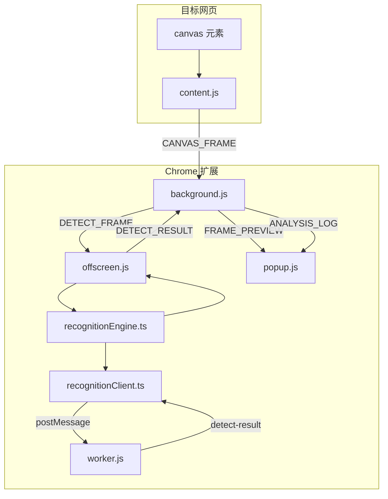
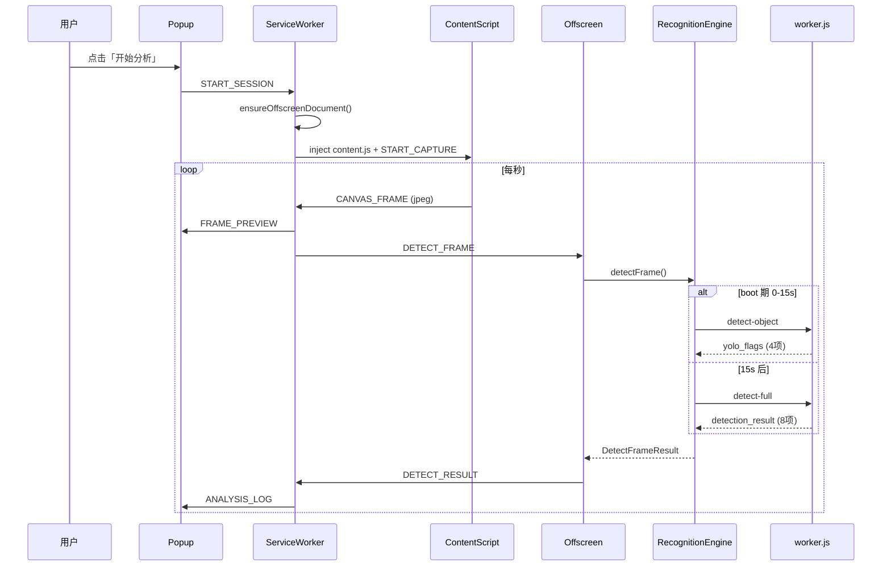
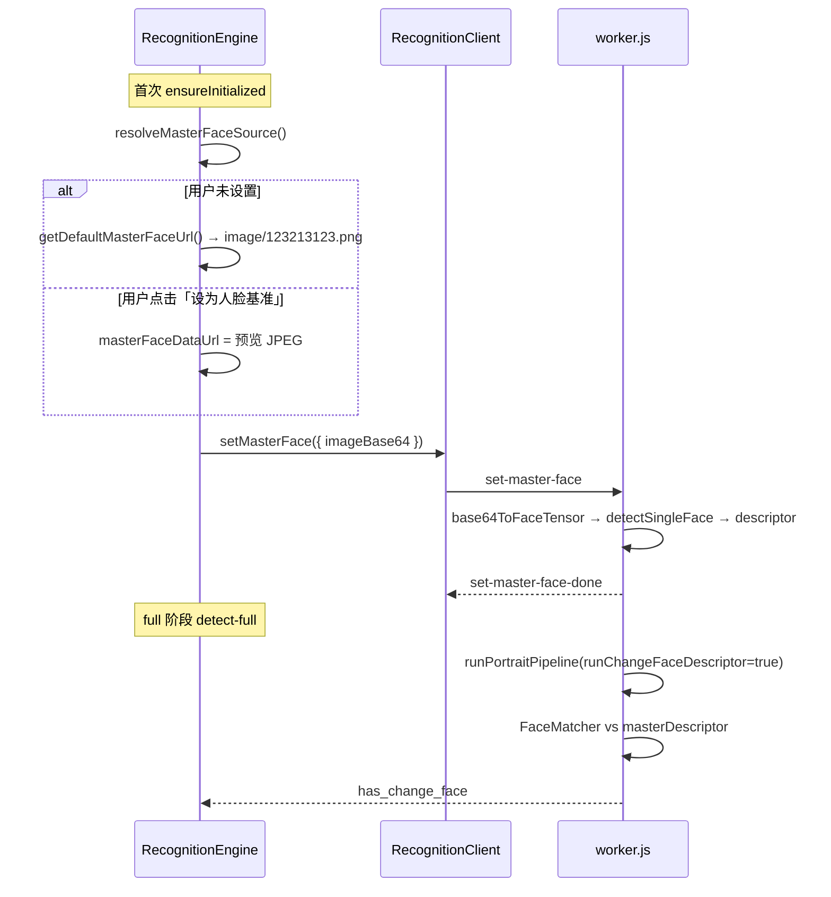

# 识别模块实现说明

本文档描述方案 A 精简后的扩展各文件职责、消息流转与核心实现逻辑。架构总览见 [architecture.md](./architecture.md)，构建与排障见 [build-and-run.md](./build-and-run.md)。

---

## 1. 总体架构

扩展将网页 `<canvas>` 每秒导出为 JPEG，经 Service Worker 路由到 Offscreen Document，由 `RecognitionEngine` 调度 `public/worker.js` 完成 YOLO + face-api 推理，结果回传 Popup 显示。

**唯一推理面**：`public/worker.js`（Dedicated Worker）。Offscreen 主线程不加载 TensorFlow / face-api。

**失败策略（fail_hard）**：Worker 初始化或推理失败时直接返回 `success: false`，**无**主线程降级、**无**自动重试。



---

## 2. 端到端时序



---

## 3. 识别调度节奏

由 `src/recognition/recognitionEngine.ts` 控制，配置项 `bootYoloOnlyDurationMs: 15000`。

| 阶段 | 时间 | Worker 调用 | 返回 phase | 标志位 |
|------|------|-------------|------------|--------|
| Boot | 启动后 0–15s | `detect-object` | `object` | YOLO 四项有效，face 四项恒为 `false` |
| Full | 15s 之后 | `detect-full` | `full` | 8 项同帧合并返回 |

**换人检测频率**：`changeFaceDetectEveryPortraitCycles: 2`，即 full 阶段第 1 帧及每 2 帧执行一次 descriptor 比对（其余帧仍跑 face 角度/越界，但跳过换人 descriptor 计算以减负）。

**超时**：

- Offscreen 单帧：`detectFrameTimeoutMs`（默认 12s），超时标记 `phase: error`
- Service Worker 兜底：`detectFrameTimeoutMs + 3000`（15s）
- Worker RPC：`recognitionWorkerTimeoutMs`（默认 120s，覆盖模型加载）

---

## 4. 八项检测标志

定义于 `src/shared/messages.ts` 与 `src/recognition/types.ts`（结构一致）。

| 字段 | 中文 | 来源 | 判定逻辑（Worker） |
|------|------|------|-------------------|
| `not_person` | 无人 | YOLO | `person` 检测框数量 < 1 |
| `multi_person` | 多人 | YOLO | `person` 检测框数量 > 1 |
| `has_book` | 疑似书籍 | YOLO | 存在 `book` 类别且 score > 0.2 |
| `has_phone` | 疑似手机 | YOLO | 存在 `cell phone` 或 `remote` 且 score > 0.2 |
| `has_pitch` | 低头 | face-api | `angle.pitch < -9` |
| `has_yaw` | 转头 | face-api | yaw/roll/pitch 超阈值（见 worker.js） |
| `has_change_face` | 换人 | face-api | 当前脸 descriptor 与基准不匹配 |
| `has_out_bounds` | 越界 | face-api | 人脸框四角任一点超出围栏矩形 |

日志格式由 `buildAnalysisLogText()` 生成，例如：

```
[canvas-ai][full] not_person=无人；has_phone=疑似手机
```

---

## 5. 消息协议

常量定义：`src/shared/messages.ts` 的 `MSG` 对象。

### 5.1 Popup ↔ Service Worker

| 消息 | 方向 | 载荷要点 | 处理方 |
|------|------|----------|--------|
| `START_SESSION` | Popup → SW | `tabId` | 创建 Offscreen、注入 content、开始抓帧 |
| `STOP_SESSION` | Popup → SW | `tabId` | 停止抓帧、清理 session、空闲时关闭 Offscreen |
| `SET_MASTER_FACE` | Popup → SW | `jpeg`（data URL） | 转发至 Offscreen 更新基准人脸 |
| `SESSION_STATE` | SW → Popup | `running`, `engineReady` | 更新按钮状态 |
| `SESSION_ERROR` | SW → Popup | `message` | 显示错误横幅 |
| `FRAME_PREVIEW` | SW → Popup | `jpeg`, `width`, `height` | 更新预览图 |
| `ANALYSIS_LOG` | SW → Popup | `phase`, `flags`, `text`, `hasAlert` | 写入日志列表与「最新结果」 |

### 5.2 Content Script ↔ Service Worker

| 消息 | 方向 | 说明 |
|------|------|------|
| `START_CAPTURE` | SW → CS | 启动 1s 定时抓帧 |
| `STOP_CAPTURE` | SW → CS | 停止定时器 |
| `CANVAS_FRAME` | CS → SW | JPEG + 画布尺寸 |
| `CAPTURE_ERROR` | CS → SW | `NO_CANVAS` / `TAINTED` / `ZERO_SIZE` |

### 5.3 Service Worker ↔ Offscreen

| 消息 | 方向 | 说明 |
|------|------|------|
| `DETECT_FRAME` | SW → OS | 与 `CANVAS_FRAME` 同结构，送入推理 |
| `DETECT_RESULT` | OS → SW | `phase`, `flags`, `success`, `errorMessage` |
| `SET_MASTER_FACE` | SW → OS | 更新换人基准 |
| `ENGINE_STATUS` | OS → Popup | 模型预加载状态（绕过 SW 直发） |

---

## 6. 各文件职责与实现逻辑

### 6.1 `src/content/canvasCapture.ts`

**职责**：在目标页每秒抓取最合适的 `<canvas>` 并导出 JPEG。

**Canvas 选择算法** `selectCanvasForCapture()`：

1. 遍历页面所有 `canvas`
2. 用 `getVisibleCanvasScore()` 打分：可见面积（`getBoundingClientRect` × 可见性样式）；不可见但存在则降权为 1/10
3. 取得分最高者

**抓帧** `captureCanvasFrame()`：

- `toDataURL('image/jpeg', 0.8)` 导出
- 失败（跨域污染）→ `CAPTURE_ERROR: TAINTED`
- 无 canvas / 零尺寸 → 对应错误码

**定时**：`setInterval(captureCanvasFrame, 1000)`，与 `RECOGNITION_CONFIG.detectIntervalMs` 一致。

---

### 6.2 `src/background/serviceWorker.ts`

**职责**：会话生命周期、Offscreen 管理、帧路由、检测队列、结果分发。

**会话状态** `TabSession`：

```typescript
{
  tabId, running, engineReady,
  isDetecting,    // 当前是否有帧在 Offscreen 推理
  pendingFrame    // 推理中时只保留最新一帧
}
```

**检测队列（两级「只保留最新帧」）**：

1. **SW 层** `enqueueDetectFrame()`：`isDetecting === true` 时覆盖 `pendingFrame`，否则 `dispatchDetectFrame()`
2. **Offscreen 层** `latestPendingFrame`：推理进行中收到新帧则覆盖，drain 完成后处理最新帧

**Offscreen 生命周期**：

- `ensureOffscreenDocument()`：`chrome.offscreen.createDocument`，reason 为 `DOM_SCRAPING`
- `closeOffscreenIfIdle()`：所有 tab session 停止后关闭文档

**启动流程** `startSession()`：

1. 确保 Offscreen 存在
2. `chrome.scripting.executeScript` 注入 `content.js`
3. 清除 `LAST_RESULT` 存储
4. 向 tab 发送 `START_CAPTURE`

**结果处理** `handleDetectResult()`：

- 清除检测超时定时器
- 写入 `chrome.storage.local`（`LAST_RESULT`）
- 广播 `ANALYSIS_LOG` 至 Popup
- 若有 `pendingFrame`，立即派发下一帧

---

### 6.3 `src/offscreen/offscreen.ts`

**职责**：接收 `DETECT_FRAME`，调用 `RecognitionEngine`，回传 `DETECT_RESULT`。

**模型预加载** `ensureModelsReady()`：

- 页面加载时调用 `recognitionEngine.warmupModels()`（仅 Worker `init`，不加载基准人脸）
- 成功 → `ENGINE_STATUS: ready=true`
- 失败 → `ready=false`，首帧 `ensureInitialized` 会再次尝试并抛错

**单帧超时** `runDetectFrameWithTimeout()`：

- `Promise.race`：`detectFrame` vs `detectFrameTimeoutMs`
- 超时设置 `abortToken.superseded = true`，丢弃滞后结果，发布 `phase: error`

**队列** `enqueueDetectFrame()` + `drainDetectQueue()`：串行处理，期间只保留 `latestPendingFrame`。

---

### 6.4 `src/recognition/` 模块

#### `config.ts`

集中配置，Offscreen / SW / Client 共用：

| 配置项 | 默认值 | 含义 |
|--------|--------|------|
| `detectIntervalMs` | 1000 | 抓帧间隔（与 content 一致） |
| `detectFrameTimeoutMs` | 12000 | Offscreen 单帧超时 |
| `bootYoloOnlyDurationMs` | 15000 | 仅 YOLO 的启动窗口 |
| `changeFaceDetectEveryPortraitCycles` | 2 | 换人 descriptor 采样周期 |
| `yoloInputSize` | 640 | YOLO 输入边长 |
| `nmsMaxBoxes` | 50 | NMS 最大框数 |
| `fenceWidthRatio` / `fenceHeightRatio` | 0.8 | 围栏占画布比例 |
| `faceDetectorType` | `'Tiny'` | 人脸检测器 |
| `faceScoreThreshold` | 0.2 | 人脸置信度阈值 |
| `faceInputSize` | 160 | TinyFaceDetector 输入 |
| `defaultModelDir` | `'yolo11'` | YOLO 模型目录 |
| `recognitionWorkerScriptUrl` | `chrome.runtime.getURL('worker.js')` | Worker 脚本 URL |
| `recognitionWorkerTimeoutMs` | 120000 | Worker RPC / init 超时 |

#### `types.ts`

- `DetectionResultFlags` / `YoloDetectionFlags`：推理结果结构
- `FenceRect`：围栏矩形 `{ x, y, width, height }`
- Worker 入站/出站消息类型（`init`、`detect-object`、`detect-full`、`set-master-face` 等）
- `PROCTOR_WORKER_BUSY`：Worker 忙时错误码

#### `assets.ts`

生成扩展内静态资源 URL：

- `getExtensionAssetUrl()` → `chrome-extension://<id>/...`
- `getYoloModelJsonUrl('yolo11')` → `.../models/yolo11/model.json`
- `getExtensionFaceModelsBaseUrl()` → `/models/face-api/`（face-api `loadFromUri` 用相对路径）

#### `fenceHelper.ts`

根据画布尺寸与 `fenceWidthRatio` / `fenceHeightRatio` 计算居中围栏矩形，供 face 越界检测使用。

#### `masterFace.ts`

内置基准人脸路径 `image/123213123.png`，通过 `getDefaultMasterFaceUrl()` 转为扩展 URL，在首次 `ensureInitialized` 时传给 Worker。

#### `recognitionClient.ts`

**Worker RPC 封装**，与 `public/worker.js` 一一对应。

**生命周期**：

1. `init()` → `doInit()`：先 `dispose()` 旧 Worker，创建新 Worker，发送 `init` 消息，等待 `init-done` / `init-error`
2. `detectObject(bitmap)` → `detect-object`，`ImageBitmap` 通过 `postMessage` transfer
3. `detectFull({...})` → `detect-full`
4. `setMasterFace({ imageBase64 })` → `set-master-face`
5. `dispose()` → 发送 `dispose` 并 `terminate()`

**并发控制**：

- `workerBusy`：同一时刻只允许一个 detect 请求；忙时抛 `PROCTOR_WORKER_BUSY`
- `pendingMap` + `requestId`：异步响应匹配
- `workerSessionId`：dispose 后忽略旧 session 的迟到消息

**无降级**：`init-error`、detect `success: false`、超时均直接 `throw`，由上层 `RecognitionEngine` 捕获。

#### `recognitionEngine.ts`

**对外 API**：

| 方法 | 说明 |
|------|------|
| `getUpcomingDetectPhase()` | 未初始化 → `init`；boot 期 → `object`；否则 → `full` |
| `warmupModels()` | 预加载 Worker（`client.init`） |
| `setMasterFace(jpeg)` | 缓存 data URL，已初始化则立即 `client.setMasterFace` |
| `detectFrame(jpeg, w, h)` | 主入口：解码 JPEG → `ImageBitmap` → 按节奏调用 Worker |
| `dispose()` | 销毁 Worker |

**`detectFrame` 流程**：

```
ensureInitialized()
  → bootStartedAt = Date.now()（仅首次）
  → client.init() + setMasterFace(内置或用户基准)
loadImageFromDataUrl(jpeg) → createImageBitmap()

if (now - bootStartedAt < 15s)
  client.detectObject(bitmap) → yoloToFullFlags() → phase: object
else
  client.detectFull({ bitmap, fence, enableChangeFace, runChangeFaceDescriptor })
  → phase: full

catch → phase: error, success: false（含 Failed to fetch 友好提示）
```

---

### 6.5 `public/worker.js`

**职责**：Dedicated Worker 内完成全部 AI 推理。扩展自有维护，**不**由 `copy-assets` 从 aiIdentification 覆盖。

#### 环境初始化（扩展 Worker 特有问题）

Chrome 扩展 Dedicated Worker **无** `window` / `document`，face-api 默认环境探测会失败。初始化顺序：

1. `importScripts('./js/face-api.js')`
2. **`faceapi.env.setEnv(...)`** — 在 `monkeyPatch` / `getEnv` 之前注入 `Canvas`、`fetch` 等
3. `createSafeOffscreenCanvas(w, h)` — 包装 `OffscreenCanvas`，防止零参 `new` 报错
4. `faceapi.env.monkeyPatch({ Canvas: createSafeOffscreenCanvas, ... })`
5. `importScripts('./js/tf-webgpu-bundle.js')`
6. `registerWorkerExtensionTfIo()` — 为 `chrome-extension://` URL 注册 TF 加载路由
7. `faceapi.env.monkeyPatch({ tf })`
8. `initWorkerTfBackend()` — **仅** `tf.setBackend('webgpu')`，非 webgpu 则抛错

#### 消息处理

| type | 处理函数 | 行为 |
|------|----------|------|
| `init` | `handleInit` | 加载 face-api 权重 + YOLO GraphModel → `init-done` |
| `set-master-face` | `handleSetMasterFace` | 从 base64 JPEG 提取 descriptor 存入 `masterDescriptor` |
| `detect-object` | `handleDetectObject` | 仅 YOLO → `yolo_flags` |
| `detect-full` | `handleDetectFull` | YOLO + `runPortraitPipeline` → 合并 8 项 |
| `detect-portrait` | `handleDetectPortrait` | 兼容保留，当前引擎不调用 |
| `dispose` | `handleDispose` | 释放模型与状态 |

#### YOLO 推理 `detectYoloFromBitmap()`

1. `preprocessFromBitmap()`：pad 成正方形 → resize 640×640 → 归一化
2. `yoloModel.execute()` → transpose → 解析 boxes/scores/classes
3. `tf.image.nonMaxSuppressionAsync`（iou=0.45, score=0.2）
4. `renderBoxes()` + `namesToFlags()` → 四项布尔

#### 人像管线 `runPortraitPipeline()`

前置短路：YOLO 已判无人/多人 → 直接返回 face 全 false。

1. `bitmapToCanvas()` → `tf.browser.fromPixels()` 得 **Tensor3D**（face-api 不认裸 `OffscreenCanvas`）
2. `faceapi.detectAllFaces(tensor).withFaceLandmarks()`，按需 `.withFaceDescriptors()`
3. 角度检测 → `has_pitch` / `has_yaw`
4. 围栏四角检测 → `has_out_bounds`
5. 换人：`FaceMatcher.findBestMatch()`，label 非 `AI模型识别专用名` 且 score ≥ 0.85 → `has_change_face`

#### 忙锁

`detectBusy`：并发请求返回 `PROCTOR_WORKER_BUSY` 并关闭传入的 `ImageBitmap`。

---

### 6.6 `src/shared/messages.ts`

**职责**：消息常量、载荷类型、日志格式化工具。

主要导出：

- `MSG`：消息类型字符串
- `buildAnalysisLogText()` / `formatDetectionFlagsChinese()` / `hasAnyDetectionAlert()`
- `STORAGE_KEYS`：`canvas_ai_last_preview`、`canvas_ai_last_result`

---

### 6.7 `src/popup/popup.ts` + `popup.html` + `popup.scss`

**职责**：用户界面——预览、开始/停止、设置基准人脸、日志与最新结果。

**`CanvasAiPopupApp` 类**：

- `handleStartSessionClick` → `START_SESSION`
- `handleStopSessionClick` → `STOP_SESSION`
- `handleSetMasterFaceClick` → 用当前预览帧 JPEG 发送 `SET_MASTER_FACE`
- 监听 `FRAME_PREVIEW` / `ANALYSIS_LOG` / `SESSION_ERROR` / `SESSION_STATE`
- `restorePinnedPreview()`：从 `chrome.storage.local` 恢复上次预览与结果
- 日志列表最多保留 100 条

---

### 6.8 `src/vendor/tfWebgpuBundle.ts`

**职责**：webpack 入口，将 `@tensorflow/tfjs-core` + `@tensorflow/tfjs-converter` + `@tensorflow/tfjs-backend-webgpu` 打成 `dist/js/tf-webgpu-bundle.js`，挂载到 `globalThis.tf`。

供 Worker `importScripts` 使用；Offscreen 主线程不加载此包。

---

### 6.9 构建与静态资源

#### `scripts/copy-assets.js`

`yarn build` 前执行（`prebuild`）：

| 操作 | 说明 |
|------|------|
| **保留** | `public/worker.js`（扩展自有） |
| **复制** | `aiIdentification/public/js/face-api.js`、`tf-csp-prelude.js` |
| **复制** | `models/yolo11/`、`models/face-api/` 全部权重 |
| **不复制** | `tf-webgpu-bundle.js`（由 webpack 生成） |
| **清理** | 遗留 `tf.min.js` 等旧文件 |

#### `webpack.config.js`

| Entry | 输出 | 说明 |
|-------|------|------|
| `background` | `background.js` | Service Worker |
| `content` | `content.js` | Content Script |
| `popup` | `popup.js` + `popup.css` | Popup |
| `offscreen` | `offscreen.js` | Offscreen |
| `js/tf-webgpu-bundle` | `js/tf-webgpu-bundle.js` | Worker TF 后端 |

`CopyWebpackPlugin` 将 `manifest.json`、`popup.html`、`offscreen.html`、`public/` 整目录复制到 `dist/`。

#### `manifest.json`

- MV3，`service_worker: background.js`
- 权限：`offscreen`、`scripting`、`storage`、`tabs`、`activeTab`
- `web_accessible_resources`：`models/*`、`worker.js`、`js/*`（Worker 与 face-api 加载权重需要）

---

## 7. 基准人脸与换人流程



换人仅在 `runChangeFaceDescriptor === true` 的帧执行 descriptor 比对；检测置信度需 ≥ 0.85。

---

## 8. 错误处理一览

| 场景 | 行为 | 用户可见 |
|------|------|----------|
| Worker init 失败 | `warmupModels` / `detectFrame` 抛错 | `ENGINE_STATUS` 失败 + `SESSION_ERROR` |
| Worker 推理失败 | `success: false`, `phase: error` | Popup 错误横幅 + 日志 |
| 单帧超时（Offscreen） | `abortToken.superseded`，发布超时错误 | 日志含 `phase=object/full` |
| 单帧超时（SW 兜底） | 15s 无 `DETECT_RESULT` | 强制 `phase: error` |
| Worker 忙 | `PROCTOR_WORKER_BUSY` | 同上（fail_hard，不排队重试） |
| Canvas 污染 | `CAPTURE_ERROR: TAINTED` | `SESSION_ERROR` |
| WebGPU 不可用 | Worker `init-error` | 明确提示 backend 非 webgpu |

**不会出现**：「降级主线程」「inferenceRunner 回退」等日志。

---

## 9. 目录结构速查

```
src/
├── background/serviceWorker.ts   # 会话、路由、队列
├── content/canvasCapture.ts      # 每秒抓 canvas JPEG
├── offscreen/
│   ├── offscreen.ts              # 帧队列 + RecognitionEngine 调度
│   └── offscreen.html            # 仅加载 offscreen.js
├── popup/
│   ├── popup.ts                  # UI 与消息监听
│   ├── popup.html
│   └── popup.scss
├── recognition/                  # 方案 A 识别模块
│   ├── config.ts
│   ├── types.ts
│   ├── assets.ts
│   ├── fenceHelper.ts
│   ├── masterFace.ts
│   ├── recognitionClient.ts      # Worker RPC
│   └── recognitionEngine.ts      # 调度引擎
├── shared/messages.ts            # 消息协议与日志格式
└── vendor/tfWebgpuBundle.ts      # TF WebGPU 打包入口

public/
├── worker.js                     # 唯一推理 Worker（扩展维护）
├── js/face-api.js                # copy-assets 同步
├── js/tf-csp-prelude.js
├── image/123213123.png           # 内置基准人脸
└── models/yolo11/、models/face-api/

scripts/copy-assets.js            # 构建前复制模型与 JS
```

---

## 10. 与 aiIdentification 的关系

方案 A 后扩展与 `aiIdentification` **分叉维护**：

| 内容 | 来源 |
|------|------|
| 模型权重、`face-api.js` | `yarn copy-assets` 从 aiIdentification 复制 |
| `public/worker.js` | 扩展仓库独立维护 |
| `src/recognition/*` | 扩展仓库独立维护 |
| `sync-ai-engine.js` | **已删除**，不再同步 TS 引擎 |

修改 Worker 行为时直接编辑 `public/worker.js` 并 `yarn build`；无需再跑历史补丁脚本。
